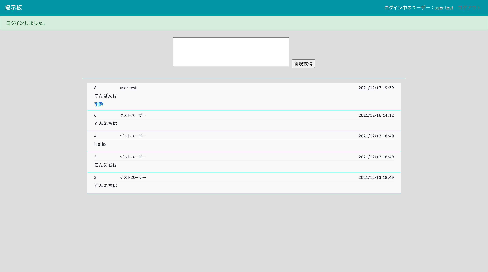
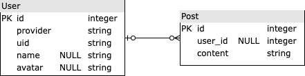

# BulletinBoard_v2について
本アプリケーションは、Ajax処理を取り入れた掲示板です。APIを利用したログイン機能やAJAX処理、N＋１問題の解決方法といったより実践的な技術について学ぶために作成をしました。ログインをして掲示板に投稿、削除ができ、チャットすることができます。
<br><br>
以下の情報でログイン可能です。<br><br>
メールアドレス：test.user.for.portfolio@gmail.com<br>
パスワード：Testuser2021
<br>
- [アプリケーションURL](https://ajaxbulletinboard.herokuapp.com/)


## 実装機能について
実装されている機能に関しては以下のようになっています。
- Googleのアカウントを利用したログイン機能。
- 掲示板に投稿、削除をする機能。
- ゲストユーザーによる投稿機能。
- gem「kaminari」を使用したページネーション機能。

1. Googleアカウントを利用したログイン機能<br>
Google APIを利用して実装しました。既存のGoogleアカウントを使用して　ワンクリックでサービスを利用することができます。<br>

2. 掲示板に投稿、削除をする機能<br>
掲示板への投稿や削除はAJAX通信で行うように実装しました。
```ruby:posts/create.js.erb
document.getElementById('posts').insertAdjacentHTML('afterbegin', '<%= j(render @post) %>'); <% # ① %>
document.getElementById('post_content').value = ""; <% # ② %>
```

```ruby:posts/index.html.erb
<%= render "form", post: @post  %>  <% # 以下のform部分を描画するコード %>
<hr color="#026873">
<div class="container">
  <%= paginate @posts %> 
  <div id="posts" class="mb-3">
<% # create.jsの①はここに作成されたpostを描画する。 %>
    <%= render @posts %>
  </div>
  <%= paginate @posts %>
</div>
```

```ruby:posts/_form.html.erb
<% # form部分のコード（一部抜粋） %>
<%= form_with(model: post, local: false) do |form| %> # local: falseを設定することでこのフォームはajax通信をする。
<% # create.jsの②は以下のフォームをリセットする。 %>
<%= form.text_area :content, id: "post_content", style: "width: 400px; height: 100px; resize: none;"%> 
```

3. ゲストユーザーによる投稿機能<br>
ゲストユーザーによる投稿は削除できないようにしました。

4. gem「kaminari」を使用したページネーション機能<br>
投稿は２０件ごとでページが分割されるようにページネーション機能を実装しました。


## データベース設計について
データベースの設計に関しては以下のER図の通りとなります。



## 使用した技術スタック
Bootstrap, Javascript, Ruby on Rails, PostgreSQL, Heroku, Google API

## 使用している主なgemについて
- Rspec：　Railsの代表的なテストツールの一つ。単体テスト、統合テストを実行するために使用しました。
- Factory Bot：　テストのサンプルデータを簡単に作成することができるgem。
- omniauth-google-oauth2：　google認証機能を使用したログイン機能を実装するためのgem。
- kaminari：　ページネーション機能を作成するためのgem。
